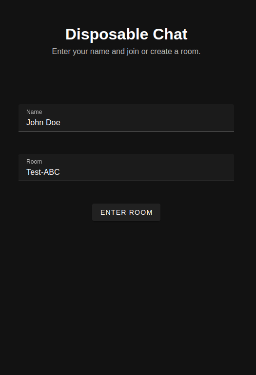
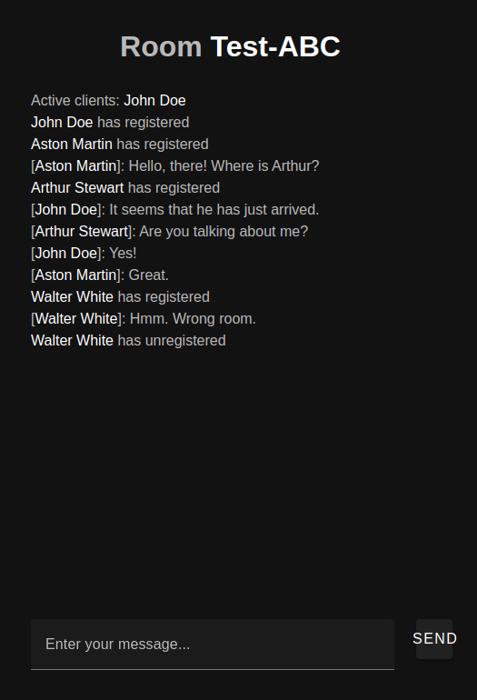

# Disposable Chat
Chat room server via web sockets. Join a room and send messages to all clients registered to it.

Web server available at [lucasmauro/disposable-chat-server](https://github.com/lucasmauro/disposable-chat-server).

## Running the server
Be sure to create a `.env` file based on `.env-example`.

### Environment Variables
| Variable   | Description                                                                     | Example
| ---------- | ------------------------------------------------------------------------------- | ----
| PORT       | The port to host the application                                                | 5173
| SERVER_URL | The URL to the [server]((https://github.com/lucasmauro/disposable-chat-server)) | ws://localhost:3333/ws

### Docker
Simply run `make docker-run` and all will be taken care of by docker compose.

### npm
Run `make install` to install all dependencies locally and then `make run` to run the server.

## Screenshots
 
